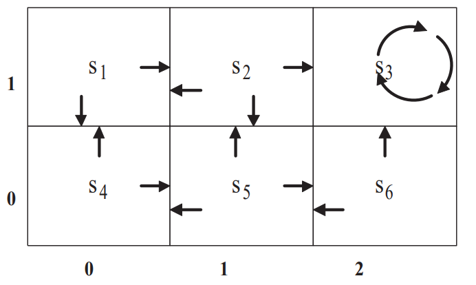

# Value Iteration

This assignment seeks to implement a value iteration algorithm. This algorithm will determine the optimal policy for navigating the following world:
<a name="l1reg">

-  The state transition distribution  is deterministic, so   = 1.0 for all states and actions.
- Rewards for all state transitions are zero except the following:
    - (1,1) -> (2,1)  = 50
    - (2,0) -> (2,1)  = 100
- S3 is the terminal state
- The discount factor is 0.8

## Compilation and Running
**Step 1:** Compile Program
```
cd src
make
```

**Step 2:** Run Program
```
cd src
make run
```
*The generate results and answers to the questions can be found in **results.txt** found in the root directory*